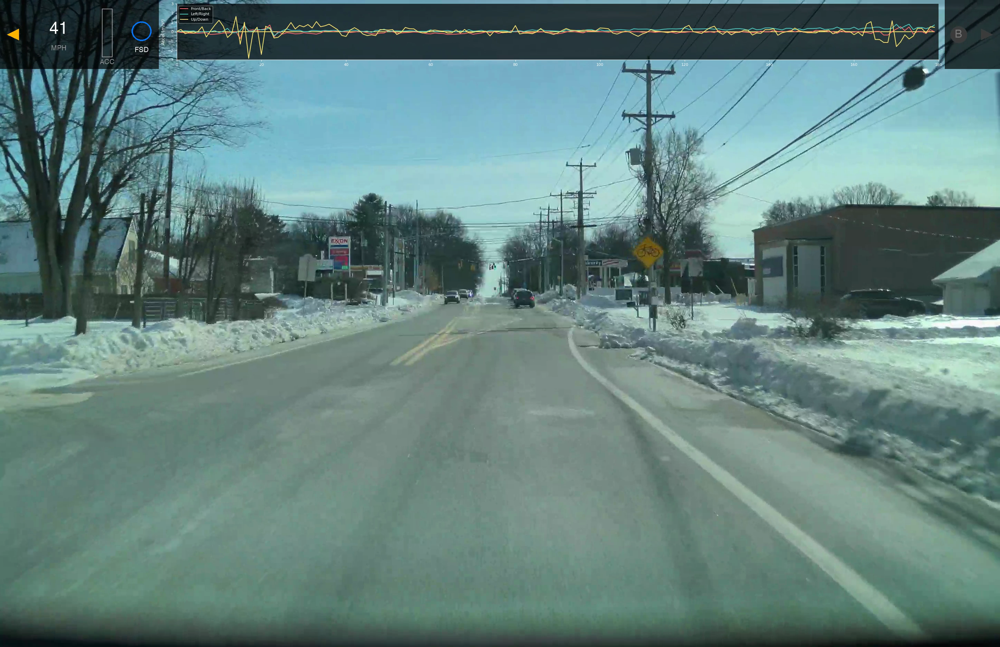

# Tesla Dashcam Telemetry Overlay

Extracts embedded SEI telemetry from Tesla dashcam MP4 files and composites a real-time overlay displaying vehicle data.



## Features

The overlay displays:
- **Speed** (MPH)
- **Accelerator pedal position** (vertical bar)
- **Autopilot/FSD state** (OFF, FSD, AUTO, TACC)
- **Rolling acceleration chart** (5-second history)
  - Front/Back (X-axis) - coral
  - Left/Right (Y-axis) - teal
  - Up/Down (Z-axis) - yellow
- **Brake indicator**
- **Turn signal indicators** (left/right)

## Requirements

- Python 3.8+
- ffmpeg
- Tesla dashcam video with SEI metadata (firmware 2025.44.25+, HW3+)

### Python dependencies

```bash
pip install numpy pillow matplotlib protobuf
```

### SEI Extractor

This tool depends on Tesla's SEI extractor. Clone it to `/tmp/tesla-dashcam`:

```bash
git clone https://github.com/tesla/dashcam /tmp/tesla-dashcam
```

Or adjust the path in the script.

## Usage

1. Edit the script to set your input/output paths:
   ```python
   INPUT_VIDEO = "/path/to/your/dashcam-video.mp4"
   OUTPUT_VIDEO = "/path/to/output-overlay.mp4"
   ```

2. Run:
   ```bash
   python overlay_dashcam.py
   ```

## How it works

The script uses a dual-pipe architecture for efficient processing:

1. **ffmpeg decoder** streams raw frames to Python
2. **Python** composites the overlay using:
   - matplotlib with blitting for the acceleration chart (only redraws lines, not axes)
   - PIL for indicator icons (pre-cached by state)
   - numpy for alpha blending
3. **ffmpeg encoder** encodes the output to H.264

Single pass, one frame in memory at a time.

## Output

- Codec: H.264
- Quality: CRF 18
- Frame rate: ~36 fps (matches input)

## License

MIT
